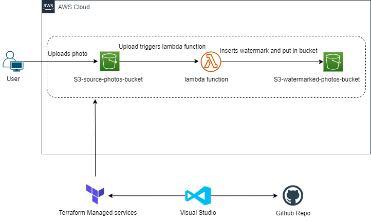

# AWS-Watermark-Project

This project is a solution to watermark images using AWS services. The AWS services used are:
* S3 bucket
* Lambda function
* Cloud watch

## S3 Bucket
There are two S3 buckets, one to store original images and the other one to store watermarked images. Once an image is uploaded on the source bucket, it triggers the lambda function which watermarks the image then stores the watermarked image on the watermarked bucket.

## Lambda function
The lambda function is a python function that uses pillow which is an open-source image processing library. Once the function is triggered, it reads the image from the event, processes the image and inserts a watermark on the image then saves the watermarked image on the watermarked bucket.

## Cloud watch
Cloud watch captures lambda function logs that are used to check and correct any errors that arise when the lambda function executes.

## Infrastructure as Code
The project incorporates Infrastructure As Code to create, manage and provision AWS resources as code using terraform.