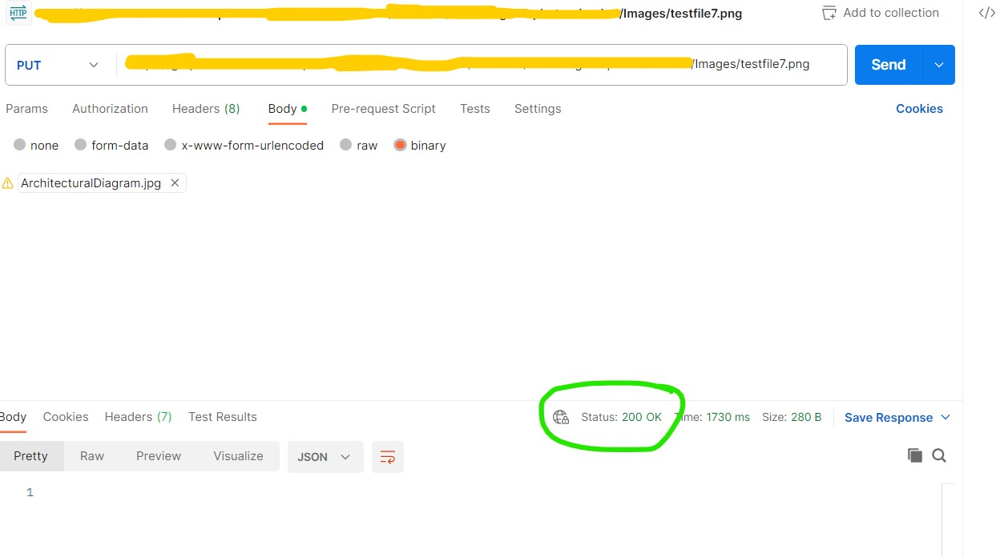

# AWS-Watermark-Project

This project is a solution to watermark images using AWS services. The AWS services used are:
* API Gateway
* S3 bucket
* Lambda function
* Cloud watch

## API Gateway
A serverless service used to create a REST API that uploads images to the source S3 bucket.

## S3 Bucket
There are two S3 buckets, one to store source images and the other one to store watermarked images. Once an image is uploaded on the source bucket, it triggers the lambda function which watermarks the image then stores the watermarked image on the watermarked bucket.

## Lambda function
The lambda function is a python function that uses pillow which is an open-source image processing library. Once the function is triggered, it reads the image from the event, processes the image and inserts a watermark on the image then saves the watermarked image on the watermarked bucket.

## Cloud watch
Cloud watch captures lambda function logs that are used to check and correct any errors that arise when the lambda function executes.

## Infrastructure as Code
The project incorporates Infrastructure As Code to create, manage and provision AWS resources as code using terraform.

## Challenges
Adding the pillow library to the lambda function was a challenge. At first, creating the library package then including it on the function package did not work as the function was failing to find the library package.

After researching, I found a better way of handling libraries which was by using lambda layers. The library is uploaded to a layer which is then attached to a lambda function. With layers, libraries can be reused as it's a matter of attaching the layer to the lambda function that needs it, which is awesome.

# Created by
* Peter Kabira